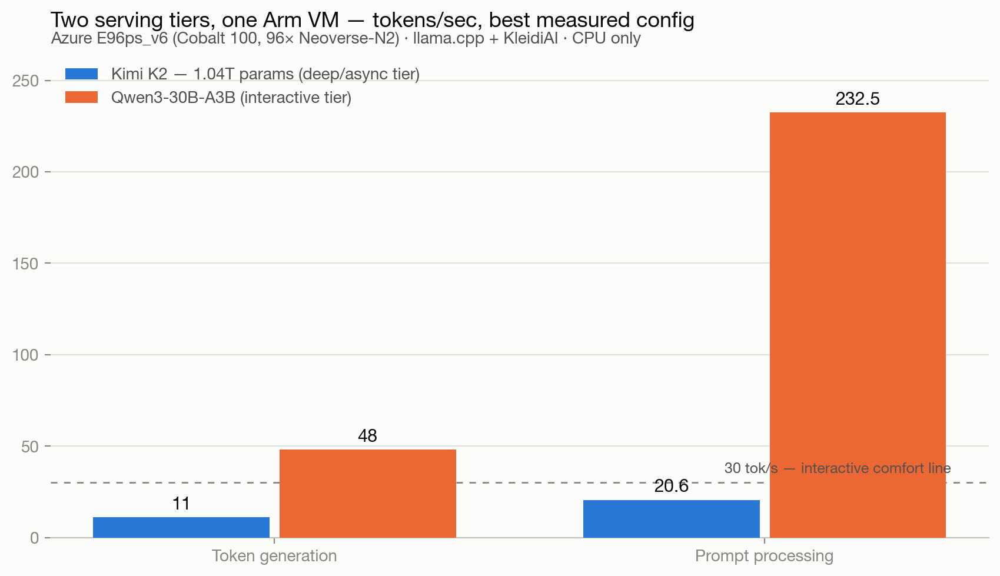
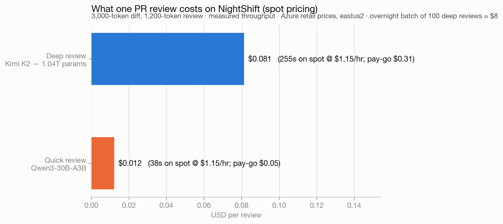
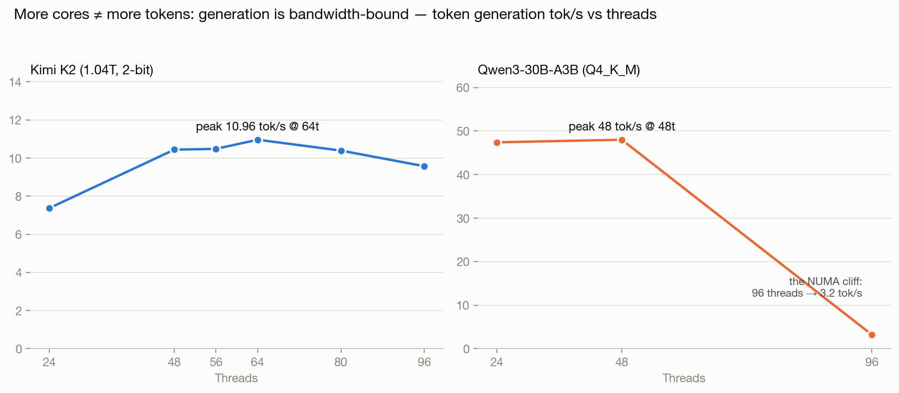
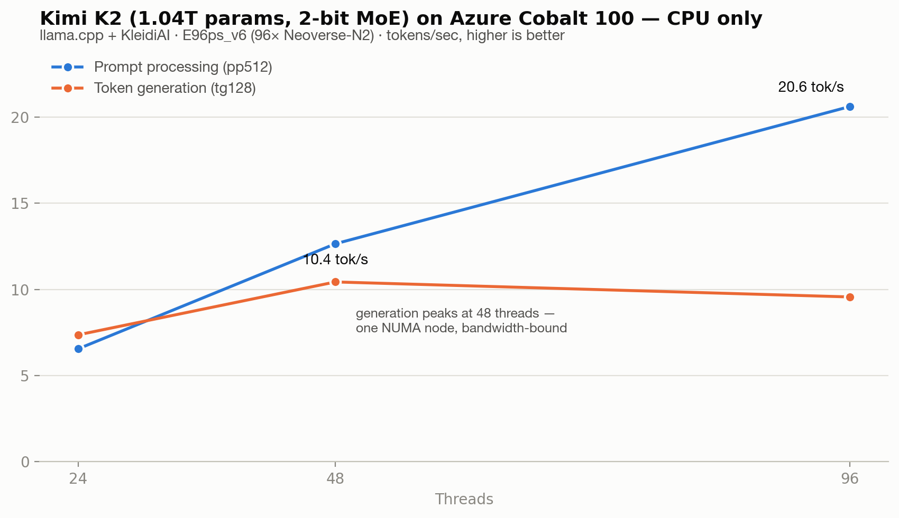

# NightShift 🌙

**A 1-trillion-parameter AI engineer that runs entirely on Arm CPUs — no GPU on Earth involved.**

NightShift runs [Kimi K2](https://github.com/MoonshotAI/Kimi-K2) — a 1.04-trillion-parameter
mixture-of-experts model — on spot-priced, Arm-based **Azure Cobalt 100** VMs, and puts it to
work on the developer tasks where cost matters and latency doesn't: reviewing your pull
requests, triaging issues, and fixing bugs overnight. For about **$1/hour**, on hardware with
zero GPUs, with your code never leaving your own Azure tenant.

> Built for the [Arm Create: AI Optimization Challenge 2026](https://arm-ai-optimization-challenge.devpost.com/) — Cloud AI track.

## Why this works (the one-paragraph version)

Trillion-parameter models are assumed to need a GPU cluster. But K2 is a mixture-of-experts
model: 1T total parameters, only **32B active per token** — so per-token compute is that of a
32B model, while the 1T just has to *fit in memory*. Azure's Arm-based Cobalt 100 VMs
(E96ps_v6: 96 cores, 672 GiB RAM) have that memory, and Arm's KleidiAI kernels (i8mm, SVE)
make quantized CPU inference fast enough for asynchronous work. NightShift measures exactly
where the limits are, then engineers around them with **expert-placement autotuning** — profiling
which of K2's 384 experts actually fire on real workloads and placing hot experts in RAM,
cold ones on NVMe, so the model fits on smaller, cheaper VMs.

## What's in this repo

| Component | What it is |
|---|---|
| [`infra/`](infra/) | **K2-in-a-box** — one `terraform apply` gives you an OpenAI-compatible, trillion-parameter endpoint on an Azure Cobalt VM |
| [`autotuner/`](autotuner/) | **ExpertAtlas** — MoE expert-activation profiler + placement autotuner (the novel engineering) |
| [`bench/`](bench/) | Reproducible benchmark harness: tokens/sec, TTFT, throughput, quality evals across quants, KleidiAI on/off, scale-up vs scale-out |
| [`action/`](action/) | **The NightShift Action** — GitHub Action that sends PRs to your endpoint for overnight review, issue triage, changelog generation |
| [`playbook/`](playbook/) | **The Trillion-Parameter CPU Playbook** — the full study, charts, and how-to |

## Quickstart

> 🚧 Under construction — challenge submission deadline is Aug 14, 2026. See [PLAN.md](PLAN.md).

```bash
# The goal:
cd infra && terraform apply        # ~15 min: Cobalt VM + model disk + llama.cpp server
export OPENAI_BASE_URL=http://<vm-ip>:8080/v1
aider --model openai/kimi-k2      # a trillion-parameter coding agent, on your own tenant
```

## The numbers (first measurements — 2026-07-31)

**It works.** Kimi K2 Thinking — 1.04 trillion parameters — running on a single Azure
E96ps_v6 (96× Arm Neoverse-N2 cores, Cobalt 100, 672 GiB RAM, **zero GPUs**):

| Metric | Measured |
|---|---|
| Token generation | **8.98 tok/s** (warm), 6.09 tok/s first run |
| Prompt processing | 29.3 tok/s |
| Time to first token | 479 ms (14-token prompt) |
| Model footprint | 360 GB on disk (Unsloth UD-Q2_K_XL dynamic 2-bit) |
| Resident memory under load | ~15 GiB hot + page-cached weights — the MoE sparsity story in one number |
| GPUs involved | 0 |

### Two tiers, one Arm VM

The same box serves both: the 1T model for deep asynchronous work (overnight PR review,
where nobody watches tokens stream) and a 30B-A3B MoE for interactive coding — comfortably
above the 30 tok/s interactive line.



### What it costs (official Azure retail pricing, measured throughput)

**A trillion-parameter deep PR review: ~8 cents on spot. An overnight batch of 100: ~$8.**



### Playbook finding #1: more cores ≠ more tokens

Generation is memory-bandwidth-bound. K2 peaks at **64 threads (11.0 tok/s)** — not 96.
Qwen3-30B falls off a cliff at 96 threads (48 → 3.2 tok/s). The E96ps_v6 spans two NUMA
nodes of 48 cores; past one node's bandwidth, threads fight instead of helping. We also
measured `--numa distribute` making K2 *4.8× slower* (2.3 tok/s), and established that
the 2-bit K2 (360 GB) cannot strict-bind to one node (330 GB/node) — but a 1-bit quant
(245 GB) can, which is the next experiment.





Raw artifacts and reproducible scripts: [`playbook/artifacts/`](playbook/artifacts/),
[`bench/`](bench/). Next: quant ladder, KleidiAI on/off, ExpertAtlas expert-placement
profiling — see [PLAN.md](PLAN.md).

## License

[Apache 2.0](LICENSE)
