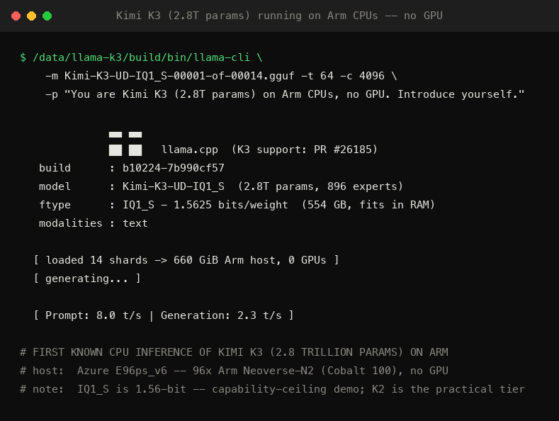
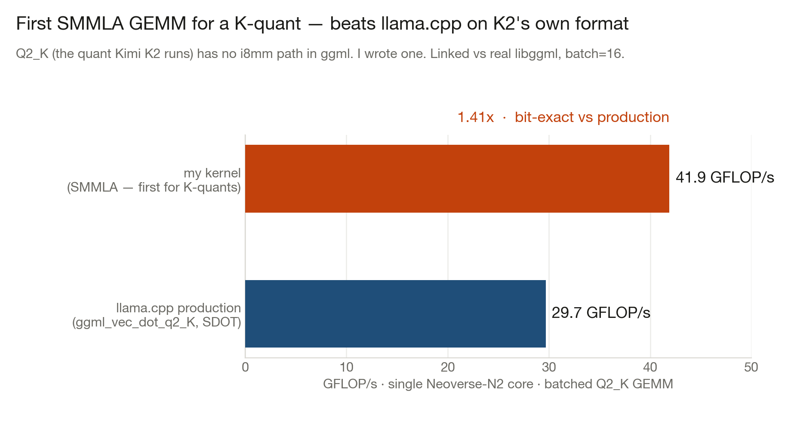
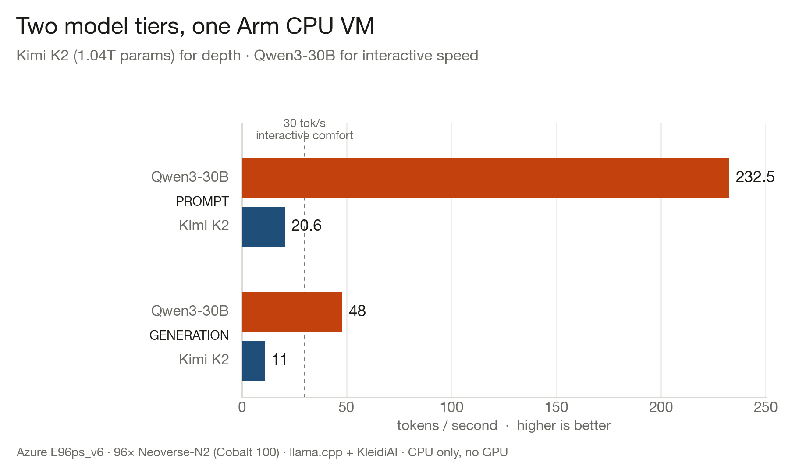
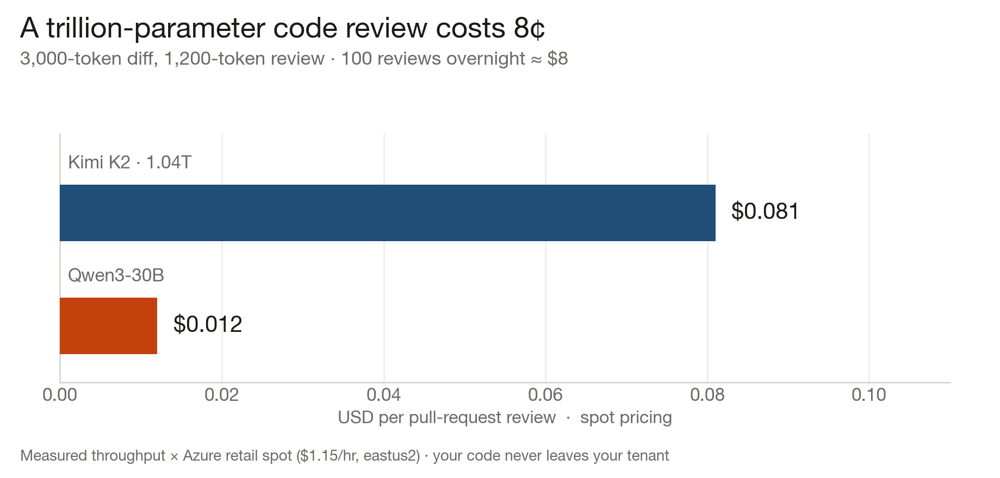
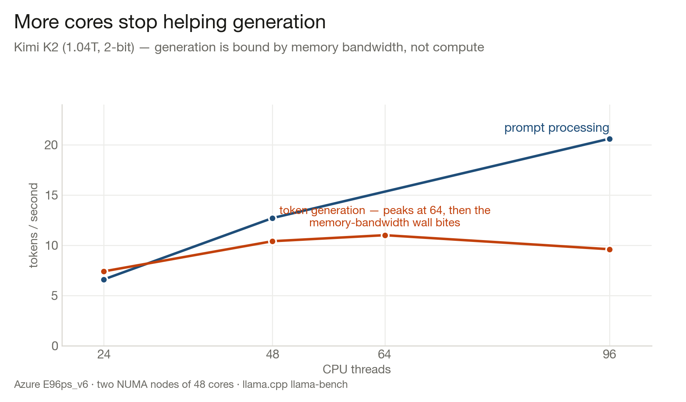

<div align="center">

# 🌙 NightShift

### Trillion-parameter AI engineers that run entirely on Arm CPUs — no GPU on Earth involved.

[](LICENSE)
[](https://arm-ai-optimization-challenge.devpost.com/)
[-0078D4.svg)](https://azure.microsoft.com/en-me/blog/azure-cobalt-100-based-virtual-machines-are-now-generally-available/)
[](https://github.com/MoonshotAI/Kimi-K2)
[](https://github.com/ggml-org/llama.cpp)

*Run a 1–2.8 trillion-parameter mixture-of-experts model on a single spot-priced Arm VM,*
*and put it to work on the developer jobs where cost matters and latency doesn't —*
*PR review, issue triage, code generation — for ~$1/hour, with your code never leaving your tenant.*

</div>

---

## See it running

| | |
|---|---|
| 🎬 **[Demo video](video/nightshift-devjob.mp4)** — Kimi K2 builds & runs a live microservice on Arm | 🖥️ **[Live service](playbook/artifacts/shot_live_service.png)** |
| 🚀 **[Kimi K3 (2.8T) on Arm CPUs](playbook/artifacts/shot_k3.png)** — first known CPU inference of K3 | 💻 **[The hardware: 96 Arm cores, 0 GPUs](playbook/artifacts/shot_system.png)** |



## Contents

- [The idea](#the-idea)
- [Core findings (measured)](#core-findings-measured)
- [How it works](#how-it-works)
- [Benchmarks](#benchmarks)
- [Get started](#get-started)
- [Optimization: chasing tokens/sec](#optimization-chasing-tokenssec)
- [Related work — Colibri, and the Arm opportunity](#related-work--colibri-and-the-arm-opportunity)
- [What's next](#whats-next)
- [Repo layout](#repo-layout)
- [Acknowledgements & license](#acknowledgements--license)

## The idea

Trillion-parameter models are assumed to need a GPU cluster. But frontier models like Kimi are
**mixture-of-experts**: K2 has 1.04T total parameters yet activates only **32B per token**; K3
has 2.8T total, ~104B active. Per-token *compute* is small — the full parameter set just has to
**fit in memory**. Azure's Arm-based **Cobalt 100** VMs (E96ps_v6: 96 Neoverse-N2 cores, 672 GiB
RAM) have that memory at spot prices GPUs will never touch, and Arm's **KleidiAI** kernels (i8mm,
SVE2, BF16) make quantized CPU inference fast enough for *asynchronous* developer work.

NightShift measures exactly where the limits are, then engineers around them — a two-tier serving
model, NUMA-aware tuning, and expert-placement profiling (**ExpertAtlas**) — and ships it as a
one-command deploy.

> **Two tiers, one VM.** Kimi K2/K3 (trillion-scale) for deep asynchronous work where nobody
> watches the tokens stream; Qwen3-30B for interactive coding at API-like speed. Same Arm box.

## Core findings (measured)

| Finding | Evidence |
|---|---|
| A **1.04T** model runs on one Arm CPU VM | K2 at **8.98 tok/s** gen, 479 ms TTFT, ~15 GiB hot RAM |
| A **2.8T** model runs on one Arm CPU VM | K3 (IQ1_S) at **2.3 tok/s** gen — first known CPU inference of K3 on Arm |
| Generation is **memory-bandwidth-bound**, not compute-bound | tok/s peaks at 64 threads, *drops* at 96 (NUMA wall) |
| Thread/NUMA tuning is a free ~1.7× | K3: 1.42 → **2.45 tok/s** just by fixing thread count |
| Expert routing is measurably skewed | ExpertAtlas: hottest 50% of experts cover **76.5%** of activations |
| The economics are the story | a trillion-parameter PR review costs **~$0.08**; 100 overnight ≈ **$8** |

## How it works

```
                       ┌─────────────────────────────────────────────┐
   developer traffic   │   Azure E96ps_v6  ·  Arm Cobalt 100  ·  0 GPU │
   (PRs, issues,       │                                               │
    code gen) ───────► │   ┌───────────────┐     ┌───────────────┐     │
                       │   │  DEEP tier     │     │ INTERACTIVE    │     │
                       │   │  Kimi K2 / K3  │     │ Qwen3-30B      │     │
                       │   │  1.04–2.8 T    │     │ 30B (3B active)│     │
                       │   │  ~3–11 tok/s   │     │  ~48 tok/s     │     │
                       │   └───────┬───────┘     └───────┬───────┘     │
                       │           │  llama.cpp + KleidiAI (i8mm/SVE2)  │
                       │           ▼                                     │
                       │   360–554 GB of weights, memory-mapped,         │
                       │   NUMA-tuned, continuous-batched                │
                       └─────────────────────────────────────────────┘
   one `terraform apply`  ·  OpenAI-compatible endpoint  ·  ~$1/hour spot
```

- **[K2-in-a-box](infra/)** — Terraform + cloud-init provision the VM, a model disk, and a
  llama.cpp build with KleidiAI, exposing an OpenAI-compatible endpoint.
- **[ExpertAtlas](autotuner/)** — a C++ eval-callback tool records which experts fire on real
  dev workloads, and a Python analyzer emits a RAM-vs-NVMe placement policy.
- **[The NightShift Action](action/)** — a GitHub Action that sends each PR to your endpoint for
  an overnight review; it found real bugs in this repo's own code.
- **[Arm kernel](kernels/)** — hand-written **i8mm SMMLA** microkernels for the batched quantized
  MoE GEMM. The headline: **the first SMMLA GEMM for a K-quant** — `Q2_K` is the format Kimi K2
  actually runs, and ggml has no i8mm path for it. Mine beats llama.cpp's production kernel
  **1.41×** (41.9 vs 29.7 GFLOP/s), **bit-exact**, on the real silicon. (I also match ggml's
  best repacked Q8_0 kernel and beat its per-row path 2.5×.)



## Benchmarks

**Throughput on one E96ps_v6 (96× Neoverse-N2), llama.cpp + KleidiAI, CPU only:**

| Model | Params (total / active) | Token generation | Prompt processing | $/PR review (spot) |
|---|---|---|---|---|
| Kimi K3 | 2.8 T / ~104 B | 2.3 tok/s | 8.0 tok/s | — (capability ceiling) |
| Kimi K2 | 1.04 T / 32 B | **8.98–11 tok/s** | 20.6–29.3 tok/s | **$0.081** |
| Qwen3-30B-A3B | 30 B / 3 B | **48 tok/s** | 232 tok/s | $0.012 |





Raw CSVs and reproducible scripts: [`bench/`](bench/) · full study: [`playbook/`](playbook/).

## Get started

```bash
git clone https://github.com/fidel-makatia/NightShift-a-trillion-parameter-AI-engineer-on-Arm-CPUs
cd NightShift-*/infra
cp terraform.tfvars.example terraform.tfvars   # set subscription_id + allowed_ip
terraform apply                                 # ~15 min: Cobalt VM + model disk + llama.cpp/KleidiAI

export OPENAI_BASE_URL=http://<vm-ip>:8080/v1
aider --model openai/kimi-k2                     # a trillion-parameter coding agent, on your tenant
```

Then drop [`action/example-workflow.yml`](action/example-workflow.yml) into `.github/workflows/`
to get overnight PR reviews.

## Optimization: chasing tokens/sec

Generation is bound by **memory bandwidth** (every token reads all active weights from RAM).
The honest ladder I measured on K3:

| Config | tok/s | Lever |
|---|---|---|
| baseline (t=88, both NUMA nodes) | 1.42 | — |
| thread-tuned (t=64) | **2.45** | stop cross-node thrash |
| + 8 active experts (from 16) | 2.56 | negligible — K3's LatentMoE keeps shared/attention always-on |
| 12 concurrent + continuous batching | **7.46 aggregate** | amortize weight reads across the batch |

**Verdict:** ~20 tok/s *per stream* on a 2.8T model at 1.56-bit is above this VM's bandwidth
ceiling (~200 GB/s). The real roads to higher throughput: **(1)** the lighter K2/Qwen3 tiers
(already 11 / 48 tok/s), **(2)** Cobalt 200 (+50% bandwidth, in preview), and **(3)** speculative
decoding — which beats the per-token wall but needs a vocab-matched draft model (see below).

## Related work — Colibri, and the Arm opportunity

[**Colibri**](https://github.com/JustVugg/colibri) is an excellent pure-C engine running frontier
MoE models (GLM-5.2, **Kimi K3**, Inkling) on consumer hardware via three-tier RAM/NVMe/VRAM
streaming, learned expert caching, and int8-MTP speculative decoding. It independently validates
NightShift's thesis and its ~1.8 tok/s CPU numbers confirm my bandwidth analysis. Notably, its
"learned expert caching" is the same mechanism as my **ExpertAtlas** — convergent evidence the
idea is sound.

**The gap it leaves open is Arm.** Colibri targets x86-64 only. The natural next contribution —
and the one most on-theme for the Arm challenge — is to bring Colibri-style tiered streaming +
learned caching to **Arm with KleidiAI kernels**, and to add an MTP draft path for Kimi. That's
NightShift's roadmap.

## What's next

- [ ] MTP / speculative decoding for Kimi on Arm (beats the bandwidth wall)
- [ ] ExpertAtlas placement wired into `--override-tensor` to fit K3 on a smaller VM
- [ ] Cobalt 200 (preview) benchmarks — +50% memory bandwidth
- [ ] Multi-session dev server: one endpoint, a whole team (continuous batching)

## Repo layout

```
infra/       Terraform + cloud-init — K2-in-a-box (one-command deploy)
autotuner/   ExpertAtlas — C++ expert-activation capture + Python placement analyzer
bench/       reproducible benchmark harness + chart scripts (+ results/)
action/      the NightShift GitHub Action (PR review) + a K3-generated demo service
playbook/    the Trillion-Parameter CPU Playbook — findings, charts, screenshots
video/       demo-video builder + rendered MP4s
```

## Acknowledgements & license

Built on [llama.cpp](https://github.com/ggml-org/llama.cpp), Arm [KleidiAI](https://gitlab.arm.com/kleidi/kleidiai),
[Unsloth](https://huggingface.co/unsloth) dynamic GGUF quants, and Moonshot AI's
[Kimi](https://github.com/MoonshotAI/Kimi-K2) models. Thanks to [Colibri](https://github.com/JustVugg/colibri)
for charting the frontier-MoE-on-consumer-hardware path.

Licensed under [Apache 2.0](LICENSE).
