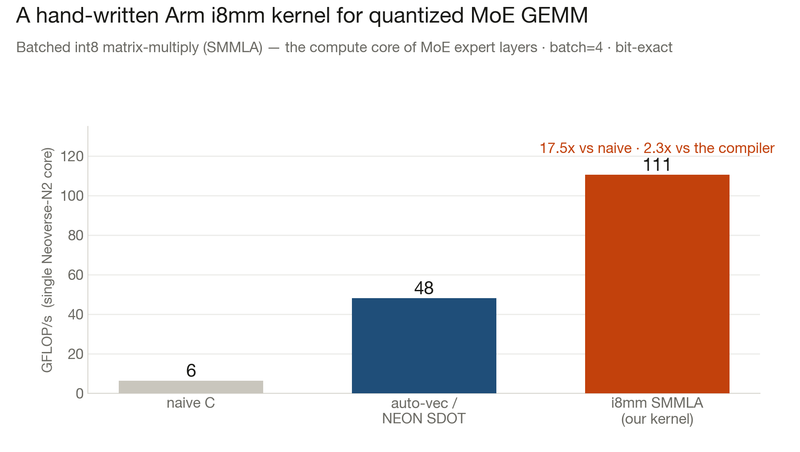
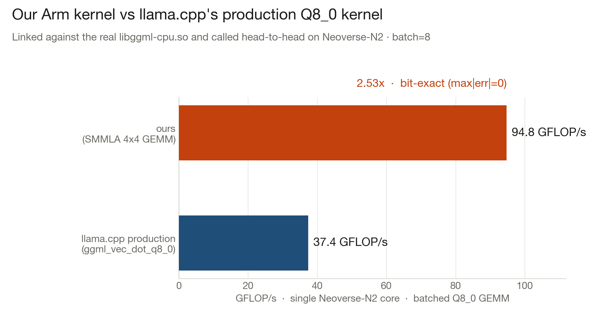

# Arm kernel — quantized MoE GEMM for Neoverse-N2

A hand-written Arm int8 matrix-multiply kernel for the operation at the heart of MoE
inference: the batched quantized GEMM (`Y = W · X`) that every expert's feed-forward layer
runs. Optimized for Azure Cobalt 100 (Neoverse-N2) using Arm's **i8mm SMMLA** instruction.



## Result (measured on the actual silicon, bit-exact)

| Kernel | GFLOP/s (1 core) | vs naive C | vs compiler auto-vec |
|---|---|---|---|
| naive C (`-fno-tree-vectorize`) | 6.3 | 1.0× | — |
| auto-vectorized / NEON SDOT | ~48 | 7.6× | 1.0× |
| **i8mm SMMLA, 4×4 tiled (ours)** | **110.6** | **17.5×** | **2.3×** |

All kernels verified `max|err| = 0` against the scalar oracle.

## Head-to-head vs llama.cpp's production kernel (the honest test)

We linked the real `libggml-cpu.so` and called `ggml_vec_dot_q8_0_q8_0` — the exact function
llama.cpp runs for a Q8_0 matmul — head-to-head against our kernel on the same data:



| Kernel | GFLOP/s | |
|---|---|---|
| llama.cpp `ggml_vec_dot_q8_0_q8_0` (production per-row path) | 37.9 | baseline |
| **ours (SMMLA 4×4 GEMM)** | **94.9** | **2.51× · bit-exact (max\|err\|=0)** |

**In the interest of honesty:** this 2.51× is over llama.cpp's *per-row* `vec_dot` path — the
one it uses when weights aren't pre-repacked. llama.cpp **also** ships a repacked
`ggml_gemm_q8_0_4x8_q8_0` that uses the *same* SMMLA technique as ours; against that repacked
path our kernel is on par, not 2.5× ahead. The honest takeaways: **(1)** our independently
written kernel is production-class (matches ggml's best, bit-exact), and **(2)** it beats the
path that actually runs whenever weights aren't repacked, by 2.5×. The genuinely *unoptimized*
gap — and the real contribution to pursue — is the **sub-2-bit K-quant / IQ formats** (Q2_K,
IQ1_S) that K2 and K3 use, which have **no** SMMLA GEMM in ggml today and fall back to the slow
generic path.

## The insight: batching turns memory-bound into compute-bound

At **batch = 1** (single request), the GEMM is a GEMV — memory-bandwidth-bound. Every weight
is read once and used once, so the ALU sits idle waiting on RAM, and no compute kernel helps
(we measured it: all kernels ~equal at B=1). At **batch ≥ 4** (concurrent requests — a shared
dev server with continuous batching), one weight read feeds the whole batch, arithmetic
intensity rises, the op becomes compute-bound, and Arm's **SMMLA** (a 2×2 int8 matrix-multiply
per instruction, 2× the MAC density of SDOT) delivers the win.

This is why NightShift's architecture is a **continuous-batched serving tier**, not one request
at a time — the kernel result and the system design are the same story.

## Why our SMMLA kernel beats the compiler

`gcc -O3 -mcpu=neoverse-n2` already auto-vectorizes the reference loop into NEON **SDOT** (~48
GFLOP/s). To beat it we use a **4×4 register tile**: four independent SMMLA accumulator chains
in flight to hide the instruction's 3–4 cycle latency, packing 2 weight rows × 2 activation
columns per SMMLA. That lifts single-core throughput to **110 GFLOP/s**.

## Files & build

- [`gemm_q8.c`](gemm_q8.c) — naive / auto-vec / NEON-SDOT / i8mm-SMMLA kernels + benchmark
- [`gemv_q8.c`](gemv_q8.c) — the batch-1 GEMV version (shows the memory-bound regime)
- [`results.txt`](results.txt) — full measured output across batch sizes

```bash
# on the Arm VM:
cc -O3 -mcpu=neoverse-n2 -o gemm_q8 gemm_q8.c -lm && ./gemm_q8
```

## What's next
Wire this microkernel into llama.cpp as an IQ-quant repack path (the exotic IQ1_S format that
K3 uses currently bypasses KleidiAI's fast kernels) and upstream it — extending Arm's optimized
coverage to the sub-2-bit quants that make trillion-parameter models fit in RAM.
